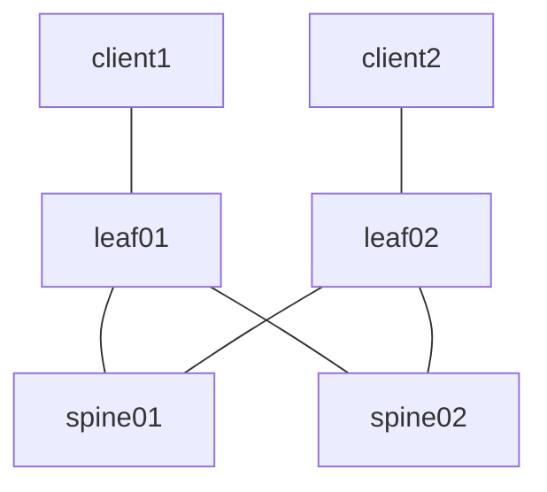

# clab-frr-evpn-vxlan

## Overview

A three-stage Layer 3 Leaf/Spine (L3LS) EVPN fabric using [CONTAINERlab](https://containerlab.dev/) and [FRR](https://docs.frrouting.org/en/latest/index.html) nodes to enable Layer 2 connectivity between two clients. Based on the FRR [EVPN guide](https://docs.frrouting.org/en/latest/evpn.html), this setup focuses on L2VNI (MAC-VRF) connectivity, with potential for further exploration of L3VNI (IP-VRF) aspects. The underlay connectivity in this fabric is faciliated by eBGP/EVPN, and the overlay connectivity is facilitated by VXLAN.

## Requirements

- [CONTAINERlab](https://containerlab.dev/install/)
  - _The [CONTAINERlab](https://containerlab.dev/install/) installation guide outlines various installation methods. This lab assumes all [pre-requisites](https://containerlab.dev/install/#pre-requisites) (including Docker) are met and CONTAINERlab is installed via the [install script](https://containerlab.dev/install/#install-script)._
- Python 3

## Topology



## Resources

### IP Assignments

_The **Overlay/VTEP** assignments for spine01/spine02 are not actually implemented, or even required, since our VTEP's in this lab are on leaf01/leaf02. The assignments are therefore just for consistency purposes_

| Scope              | Network       | Sub-Network   | Assignment    | Name            |
| ------------------ | ------------- | ------------- | ------------- | -------         |
| Management         | 172.28.1.0/24 |               | 172.28.1.2/24 | spine01         |
| Management         | 172.28.1.0/24 |               | 172.28.1.3/24 | spine02         |
| Management         | 172.28.1.0/24 |               | 172.28.1.4/24 | leaf01          |
| Management         | 172.28.1.0/24 |               | 172.28.1.5/24 | leaf02          |
| Router ID (lo)     | 172.29.1.0/24 |               | 172.29.1.1/24 | spine01         |
| Router ID (lo)     | 172.29.1.0/24 |               | 172.29.1.2/24 | spine02         |
| Router ID (lo)     | 172.29.1.0/24 |               | 172.29.1.3/24 | leaf01          |
| Router ID (lo)     | 172.29.1.0/24 |               | 172.29.1.4/24 | leaf02          |
| Overlay/VTEP (lo1) | 172.30.1.0/24 |               | 172.30.1.1/24 | spine01         |
| Overlay/VTEP (lo1) | 172.30.1.0/24 |               | 172.30.1.2/24 | spine02         |
| Overlay/VTEP (lo1) | 172.30.1.0/24 |               | 172.30.1.3/24 | leaf01          |
| Overlay/VTEP (lo1) | 172.30.1.0/24 |               | 172.30.1.4/24 | leaf02          |
| P2P Links          | 172.31.1.0/24 | 172.31.1.0/31 | 172.31.1.0/31 | spine01::leaf01 |
| P2P Links          | 172.31.1.0/24 | 172.31.1.0/31 | 172.31.1.1/31 | leaf01::spine01 |
| P2P Links          | 172.31.1.0/24 | 172.31.1.2/31 | 172.31.1.2/31 | spine01::leaf02 |
| P2P Links          | 172.31.1.0/24 | 172.31.1.2/31 | 172.31.1.3/31 | leaf02::spine01 |
| P2P Links          | 172.31.1.0/24 | 172.31.1.4/31 | 172.31.1.4/31 | spine02::leaf01 |
| P2P Links          | 172.31.1.0/24 | 172.31.1.4/31 | 172.31.1.5/31 | leaf01::spine02 |
| P2P Links          | 172.31.1.0/24 | 172.31.1.6/31 | 172.31.1.6/31 | spine02::leaf02 |
| P2P Links          | 172.31.1.0/24 | 172.31.1.6/31 | 172.31.1.7/31 | leaf02::spine02 |

### ASN Assignments

| ASN   | Device  |
| ----- | ------- |
| 65500 | spine01 |
| 65501 | spine02 |
| 65502 | leaf01  |
| 65503 | leaf02  |

### VXLAN Segments

| vni | name | network      | leaf   | host    | host ip   | vlan |
| --- | ---- | ------------ | ------ | ------- | --------- | ---- |
| 110 | RED  | 10.10.1.0/24 | leaf01 | client1 | 10.10.1.1 | 10   |
| 110 | RED  | 10.10.1.0/24 | leaf02 | client2 | 10.10.1.2 | 10   |

## Deployment

Clone this repsoitory and start the lab

```shell
git clone https://github.com/dbono711/clab-frr-evpn-vxlan.git
cd clab-frr-evpn-vxlan
make all
```

**_NOTE: CONTAINERlab requires SUDO privileges in order to execute_**

- Initializes the ```setup.log``` file
- Creates the CONTAINERlab network based on the [setup.yml](setup.yml) [topology definition](https://containerlab.dev/manual/topo-def-file/)
  - The FRR configuration is bound to the respective ```spine``` and ```leaf``` nodes in the topology definition at startup
- Loops through each client to execute the respective configuration SHELL scripts within the [clients](clients) folder
  - The script configures the Ethernet/VLAN interface connected to the leaf
- Loops through each switch to execute the respective configuration SHELL script within the ```spine``` and ```leaf``` folders
  - The script configures the Linux-level Ethernet, Dummy, VXLAN, and Bridge interfaces; leaving the IP configuration to FRR
- Executes a PING from ```client1``` to ```client2``` to validate data plane connectivity between clients over the VNI

## Accessing the container CLI (SHELL)

The container CLI (SHELL) can be accessed by using the ```docker exec``` command, as follows:

```docker exec -it <container> bash```

For example, to access the CLI on the ```spine01``` container

```shell
$ docker exec -it clab-frr-evpn-vxlan-spine01 bash
bash-5.1#
```

## Accessing the container FRR CLI (VTYSH)

The container FRR CLI (VTYSH) can be accessed by using the ```docker exec``` command, as follows:

```docker exec -it <container> vtysh```

For example, to access the FRR CLI on the ```spine01``` container

```shell
$ docker exec -it clab-frr-evpn-vxlan-spine01 vtysh

Hello, this is FRRouting (version 8.4_git).
Copyright 1996-2005 Kunihiro Ishiguro, et al.

spine01#
```

## Validating Routing & Switching operation on FRR nodes

**_NOTE: Various Linux configurations are being applied to create the necessary Linux bridges, VXLAN interfaces, and Ethernet sub-interfaces for client connectivity, which are then integrated into FRR’s EVPN and MAC-VRF tables. They can be analyzed within the respective ```clients```, ```spine```, or ```leaf``` folders. However, this section is primarily focused on the operational commands pertaining to FRR._**

**_NOTE: All subsequent commands assume that you are able to access the FRR CLI (VTYSH) per [Accessing the container FRR CLI (VTYSH)](#accessing-the-container-frr-cli-vtysh)_**

### Displaying BGP tables

eBGP facilitates the underlay IPv4 connectivity and EVPN route exchange in the control plane for overlay connectivity between the ```spine``` and ```leaf``` FRR nodes. The design employs a multi-AS approach, assigning each spine/leaf its own ASN, utilizing both the ```ipv4 unicast``` and ```l2vpn evpn``` address families

To ensure IPv4 unicast routes are being learned accordingly, execute the following command on any one node:

```show bgp ipv4 unicast```

Not considering the allocations for the node you are executing the command from, you should see all other respective [IP assignments](#ip-assignments) in the BGP ```ipv4 unicast```table. For example, if you are executing this command on ```leaf01```, you should see; the ```Router ID (lo)``` assignments from ```spine01```, ```spine02```, and ```leaf02```, the ```Overlay/VTEP (lo1)``` assignment from ```leaf02```, and the respective ```P2P Links```

To ensure L2VPN EVPN routes are being learned accordingly, execute the following command on any one node:

```show bgp l2vpn evpn```

Not considering the allocations for the ```leaf``` node you are executing the command from, you should see the respective EVPN Type 2 and Type 3 routes. For example, if you are executing this command on ```leaf01```, you should see; the EVPN Type 3 route for 172.30.1.4 (the VTEP on ```leaf02```), and the EVPN Type 2 route for the MAC address of ```client2```

**_NOTE: If you are not seeing any EVPN Type 2 routes, for instance on ```leaf01```, execute a PING from ```client1``` to ```client2``` in order to instantiate the MAC learning process and subsequent MAC-IP advertisements in EVPN between ```leaf``` nodes_**

### Displaying EVPN information

EVPN enables the signaling of the bridged (L2) VPNs over the fabric network, acting as the control plane for the transport of Ethernet frames. To display detailed information about MAC addresses for a specified VNI, execute the following command on the leaf nodes only as they are carrying the VTEP functionality in this fabric. For example, if you are executing this command on ```leaf01```, you should see the local MAC address learned from ```client1``` and the MAC address of ```client2```, learned remotely.

```show evpn mac vni 110```

```shell
leaf01# show evpn mac vni 110
Number of MACs (local and remote) known for this VNI: 2
Flags: N=sync-neighs, I=local-inactive, P=peer-active, X=peer-proxy
MAC               Type   Flags Intf/Remote ES/VTEP            VLAN  Seq #'s
aa:c1:ab:01:47:33 remote       172.30.1.4                           0/0
aa:c1:ab:a8:9d:ab local        eth3.10                              0/0
```

**_NOTE: If you are not seeing any local or remote MAC addresses, for instance on ```leaf01```, execute a PING from ```client1``` to ```client2``` in order to instantiate the MAC learning process and subsequent MAC-IP advertisements in EVPN between ```leaf``` nodes_**

## Data Plane Validation

The [Makefile](Makefile) performs data plane validation by executing the [validate.py](validate.py) Python script which performs a PING from ```client``` to ```client2```, and thats it. The script therefore leaves a lot of room for explanation for more advanced validation such as parsing JSON output from the FRR nodes, analyzing bridge fdb tables at the Linux level of the FRR and client nodes, etc.

## Cleanup

Stop the lab, tear down the CONTAINERlab containers

```shell
make clean
```

## Logging

All activity is logged to a file called ```setup.log``` at the root of the repository.

## Authors

- Darren Bono - [darren.bono@att.net](mailto://darren.bono@att.net)

<a href="https://buymeacoffee.com/darrenbono" target="_blank"></a>

## License

This project is licensed under the MIT License. See [LICENSE](LICENSE) for details
