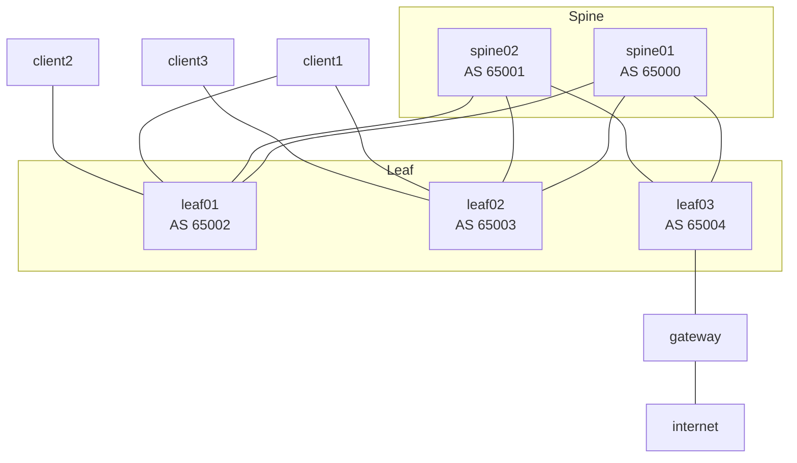

# EVPN eBGP over IPv4 eBGP — Bridged Overlay (As-Built)

## Table of Contents

1. [Scope & Overview](#1-scope--overview)
2. [Requirements](#2-requirements)
3. [Physical Topology](#3-physical-topology)
4. [Addressing Plan](#4-addressing-plan)
5. [Underlay Design](#5-underlay-design)
6. [Overlay / EVPN Control-Plane Design](#6-overlay--evpn-control-plane-design)
7. [VXLAN / Data-Plane Design](#7-vxlan--data-plane-design)
8. [Tenant Design](#8-tenant-design)
9. [External Gateway & Egress Design](#9-external-gateway--egress-design)
10. [Deployment & Operations](#11-deployment--operations)

---

## 1. Scope & Overview

This lab is a three-stage Layer 3 leaf/spine (L3LS) EVPN fabric built on [CONTAINERlab](https://containerlab.dev/) using [FRRouting](https://frrouting.org/) nodes. It demonstrates multi-tenant Layer 2 extension using a **Bridged Overlay (BO)** design per the FRR [EVPN guide](https://docs.frrouting.org/en/latest/evpn.html): the fabric signals and forwards L2VNIs (MAC-VRFs) only — there is no IRB, no L3VNI, and no VRF anywhere in `spine01`/`spine02`/`leaf01`/`leaf02`/`leaf03`. Inter-tenant and Internet routing both happen **outside** the fabric, on a dedicated `gateway` router hanging off the border leaf (`leaf03`).

| Role | Nodes | Function |
| ---- | ----- | -------- |
| Spine | `spine01`, `spine02` | Underlay transit; EVPN route source (no VTEP) |
| Leaf (VTEP) | `leaf01`, `leaf02` | Host attachment; VXLAN tunnel endpoints |
| Border leaf (VTEP) | `leaf03` | VTEP with a trunked hand-off to the external gateway |
| External gateway | `gateway` | Inter-tenant routing + Internet egress — entirely outside the EVPN/VXLAN fabric |
| Clients | `client1`, `client2`, `client3` | Tenant workloads |
| Internet | `internet` | Reference upstream, directly attached to `gateway` |

Two tenants (L2VNIs) exist: VNI 10 ("RED") spans `leaf01` and `leaf02`, hosting `client1` (dual-homed) and `client3` (single-homed); VNI 20 ("BLUE") exists only on `leaf01`, hosting `client2`. Both tenants' default gateway lives on the external `gateway` node, reached over `leaf03`.

---

## 2. Requirements

| # | Requirement | Design mechanism |
| - | ----------- | ---------------- |
| R1 | Extend a Layer 2 segment across any leaf that needs it | L2VNI (VXLAN) signalled by EVPN Type-2 (MAC) / Type-3 (IMET) routes |
| R2 | Survive a single leaf or link failure for a critical host | EVPN multi-homing — `client1` dual-homed to `leaf01`/`leaf02` via an LACP bond and a shared Ethernet Segment |
| R3 | Provide plain IPv4 reachability between loopbacks for the overlay to ride on | Single-hop eBGP `UNDERLAY` peer-group on every point-to-point link, `redistribute connected route-map CONNECTED` for the loopbacks |
| R4 | Run a scalable multi-AS EVPN control plane without full-mesh iBGP | Every node gets its own ASN; `OVERLAY` peer-group is eBGP multihop (2) between loopbacks; `bgp bestpath as-path multipath-relax` enables ECMP despite differing AS-paths |
| R5 | Keep IP routing/gateway function out of the fabric (Bridged Overlay, no IRB) | Dedicated external `gateway` router, 802.1Q-trunked to the border leaf, with one VLAN sub-interface per tenant VNI |
| R6 | Reach the Internet | `gateway`'s `eth2` uplink to `internet`, static routes in both directions (no dynamic routing to the "provider") |
| R7 | Populate the bridge FDB from the control plane, not from data-plane flooding | Every VXLAN interface is created with `nolearning`; MAC entries only appear via EVPN Type-2 |

---

## 3. Physical Topology



Physical links (from `lab.yml`):

| A end | B end | Purpose |
| ----- | ----- | ------- |
| spine01:eth1 | leaf01:eth1 | Underlay |
| spine01:eth2 | leaf02:eth1 | Underlay |
| spine01:eth3 | leaf03:eth1 | Underlay |
| spine02:eth1 | leaf01:eth2 | Underlay |
| spine02:eth2 | leaf02:eth2 | Underlay |
| spine02:eth3 | leaf03:eth2 | Underlay |
| leaf01:eth3 | client1:eth1 | Host (multi-homed, VNI 10) |
| leaf02:eth3 | client1:eth2 | Host (multi-homed, VNI 10) |
| leaf01:eth4 | client2:eth1 | Host (single-homed, VNI 20) |
| leaf02:eth4 | client3:eth1 | Host (single-homed, VNI 10) |
| leaf03:eth3 | gateway:eth1 | 802.1Q trunk (VLAN 10 + VLAN 20) |
| gateway:eth2 | internet:eth1 | Internet egress |

Spines carry no VTEP — `spine01`/`spine02` have no `lo1` interface and no VXLAN configuration anywhere in their shell scripts. They exist purely for underlay transit and as EVPN peers; the tunnel endpoints (`lo1`) only exist on `leaf01`, `leaf02`, and `leaf03`.

---

## 4. Addressing Plan

### Management — `172.28.1.0/24` (from `lab.yml` `mgmt-ipv4`)

| Node | Mgmt IP |
| ---- | ------- |
| spine01 | 172.28.1.2 |
| spine02 | 172.28.1.3 |
| leaf01 | 172.28.1.4 |
| leaf02 | 172.28.1.5 |
| leaf03 | 172.28.1.6 |
| gateway | 172.28.1.7 |
| client1 | 172.28.1.8 |
| client2 | 172.28.1.9 |
| client3 | 172.28.1.10 |
| internet | 172.28.1.11 |

### Router-IDs / loopbacks (`lo`) — `172.29.1.0/24`

| Node | Router-ID | ASN |
| ---- | --------- | --- |
| spine01 | 172.29.1.1 | 65000 |
| spine02 | 172.29.1.2 | 65001 |
| leaf01 | 172.29.1.3 | 65002 |
| leaf02 | 172.29.1.4 | 65003 |
| leaf03 | 172.29.1.5 | 65004 |

### VTEP source loopbacks (`lo1`) — `172.30.1.0/24`

| Node | VTEP IP |
| ---- | ------- |
| leaf01 | 172.30.1.3 |
| leaf02 | 172.30.1.4 |
| leaf03 | 172.30.1.5 |

`spine01`/`spine02` have no `lo1` — see [§3](#3-physical-topology).

### Underlay point-to-point links — `172.31.1.0/24` (/31s)

| Link | Spine side | Leaf side |
| ---- | ---------- | --------- |
| spine01 ↔ leaf01 | 172.31.1.0 | 172.31.1.1 |
| spine01 ↔ leaf02 | 172.31.1.2 | 172.31.1.3 |
| spine01 ↔ leaf03 | 172.31.1.8 | 172.31.1.9 |
| spine02 ↔ leaf01 | 172.31.1.4 | 172.31.1.5 |
| spine02 ↔ leaf02 | 172.31.1.6 | 172.31.1.7 |
| spine02 ↔ leaf03 | 172.31.1.10 | 172.31.1.11 |

### Tenant subnets (external gateway, `10.x.1.0/24`)

| VNI | Name | Subnet | Gateway (on `gateway`) |
| --- | ---- | ------ | ----------------------- |
| 10 | RED | 10.10.1.0/24 | 10.10.1.1 (`eth1.10`) |
| 20 | BLUE | 10.20.1.0/24 | 10.20.1.1 (`eth1.20`) |

### Provider link — `99.99.99.0/30`

| Node | IP |
| ---- | -- |
| gateway (eth2) | 99.99.99.1 |
| internet (eth1) | 99.99.99.2 |

---

## 5. Underlay Design

- **Protocol:** eBGP, `ipv4 unicast` address family, one ASN per node (`65000`–`65004`).
- **Peer-group `UNDERLAY`:** every spine–leaf physical link is a directly-connected /31 eBGP session, one AS-hop, activated only in `address-family ipv4 unicast`.
- **Loopback advertisement:** `redistribute connected route-map CONNECTED` on every node, where `CONNECTED` is a prefix-list matching only that node's own `lo` (and `lo1` on the leaves) — i.e. only loopbacks are redistributed, not every connected subnet.
- **No IGP:** unlike the OSPF-underlay designs elsewhere in this repo family, this topology uses eBGP for both underlay reachability and the overlay — there is no OSPF or IS-IS instance anywhere in this lab.
- **IPv6:** disabled fabric-wide (`no ipv6 forwarding` in every `frr.conf`).

---

## 6. Overlay / EVPN Control-Plane Design

- **Protocol:** eBGP, multi-AS (one ASN per node — the same sessions carry both underlay and overlay AFs, there is no separate iBGP overlay).
- **Peer-group `OVERLAY`:** `ebgp-multihop 2`, `update-source lo`, `capability extended-nexthop`, `remote-as` set per-neighbor to each other node's real ASN. Every leaf and spine peers to every *other* leaf/spine's loopback — there is no route-reflector and no dedicated RR tier; this is a small enough fabric (5 EVPN speakers) to run full-mesh overlay peering directly.
- **`bgp bestpath as-path multipath-relax`** on every node allows ECMP across overlay paths despite the differing AS-paths that a multi-AS design produces.
- **`no bgp ebgp-requires-policy`** and **`no bgp default ipv4-unicast`** are set on every node — the former lets eBGP sessions come up without an explicit inbound/outbound policy (there are no route-maps applied to any `neighbor ... route-map` in this lab, only the `redistribute connected` filter), the latter keeps the `ipv4 unicast` AF opt-in per session.
- **`address-family l2vpn evpn`:** every node activates `OVERLAY` and sets `advertise-all-vni`. `leaf01`, `leaf02`, and `leaf03` each additionally declare per-VNI `rd`/`route-target import`/`route-target export` blocks (see [§8](#8-tenant-design)); `spine01`/`spine02` have no VNI blocks (no local VTEP to advertise).
- **EVPN route types in use:**
  - **Type 2 (MAC):** local/remote MAC learning per VNI — populates the bridge FDB in place of data-plane learning (see [§7](#7-vxlan--data-plane-design)).
  - **Type 3 (IMET):** per-VNI flood list for BUM traffic (ingress replication).
  - **Type 4 (Ethernet Segment):** multi-homing / Designated-Forwarder election for `client1`'s dual-homed bond.
  - **No Type 5:** there is no L3VNI or VRF in this design, so no IP-prefix routes are originated by the fabric — this is what distinguishes a Bridged Overlay from a symmetric-IRB design.

---

## 7. VXLAN / Data-Plane Design

The data plane (Linux bridges + VXLAN interfaces) is built entirely in the per-node shell scripts; FRR only programs control-plane state (EVPN routes, ES config) into it.

- **Encapsulation:** VXLAN, UDP destination port **4789**, tunnel source = `lo1` (`172.30.1.x`) on each leaf.
- **`nolearning`:** every `vni<N>` interface is created with `nolearning`, so the bridge FDB is populated exclusively from EVPN Type-2 routes, not from data-plane flooding.
- **No ARP suppression:** unlike the symmetric-IRB labs in this repo family, none of the leaves set `neigh_suppress on`. ARP requests are flooded as BUM traffic via the Type-3 ingress-replication list and answered directly by the destination host; the resulting MAC is then learned into the FDB via EVPN Type-2 once traffic flows.
- **Bridged Overlay, no IRB:** each leaf's bridge (`br10`/`br20`) has no IP address of its own — there is no SVI. The bridge is purely a Layer 2 forwarding domain between the local access port(s) and the local VXLAN interface; routing between VNIs, and to the Internet, happens only on the external `gateway` node (see [§9](#9-external-gateway--egress-design)).

---

## 8. Tenant Design

### L2VNI / RD / RT matrix (as configured)

| Node | VNI | RD | Import/Export RT |
| ---- | --- | -- | ----------------- |
| leaf01 | 10 | `172.29.1.3:10` | `65999:10` |
| leaf01 | 20 | `172.29.1.3:20` | `65999:20` |
| leaf02 | 10 | `172.29.1.4:10` | `65999:10` |
| leaf03 | 10 | `172.29.1.5:10` | `65999:10` |
| leaf03 | 20 | `172.29.1.5:20` | `65999:20` |

`leaf02` only carries VNI 10 — it has no local host in VNI 20, so no `vni 20` block exists in its `frr.conf`.

### Client placement

| Client | Address | VNI / Bridge | Attachment |
| ------ | ------- | ------------- | ---------- |
| client1 | 10.10.1.2/24 (`bond0.10`) | 10 / `br10` | **Multi-homed** to `leaf01`+`leaf02` via LACP bond `bond0` |
| client2 | 10.20.1.2/24 (`eth1.20`) | 20 / `br20` | Single-homed to `leaf01` (`eth4`) |
| client3 | 10.10.1.3/24 (`eth1.10`) | 10 / `br10` | Single-homed to `leaf02` (`eth4`) |

Each client's script adds explicit static routes for the *other* tenant subnet and for the Internet prefix, all pointing at the local `gateway` IP for that VNI (e.g. `client1.sh`: `ip route add 10.20.1.0/24 via 10.10.1.1` and `ip route add 99.99.99.0/30 via 10.10.1.1`) — there is no default route anywhere in this lab, only per-destination static routes.

### EVPN multi-homing (client1)

`client1` is dual-homed to `leaf01` and `leaf02` via an LACP bond (`bond0` on the client, `mhbond1` on each leaf). Both leaves configure the same Ethernet Segment on their `mhbond1` interface:

- ES-ID: `1`
- ES system MAC: `aa:aa:39:00:00:01`
- DF preference: `101`

FRR advertises the segment via EVPN Type-4 routes and coordinates Designated-Forwarder election between `leaf01` and `leaf02` for VNI 10 traffic.

---

## 9. External Gateway & Egress Design

`gateway` is a plain FRR node with **no BGP, no EVPN, and no VXLAN** — `bgpd=yes` is set in `gateway/daemons`, but `gateway/frr.conf` contains no `router bgp` stanza, so the daemon runs idle (see [§10](#10-observations--inconsistencies)). All forwarding on `gateway` relies on directly-connected interface routes:

- `eth1` is an 802.1Q trunk to `leaf03:eth3`, with one FRR sub-interface per tenant: `eth1.10` (10.10.1.1/24) and `eth1.20` (10.20.1.1/24). These line up 1:1 with `leaf03`'s own `eth3.10`/`eth3.20` VLAN sub-interfaces, which are the access ports into `leaf03`'s `br10`/`br20` bridges — i.e. the VLAN tag is what separates the two tenants across the trunk, not a routing construct.
- `eth2` (99.99.99.1/30) connects to `internet`.
- Because `10.10.1.0/24`, `10.20.1.0/24`, and `99.99.99.0/30` are all directly connected to `gateway`, Linux/FRR's connected-route forwarding alone is sufficient for `gateway` to route between the two tenants and out to `internet` — no static routes or redistribution are configured on `gateway` itself. All the static routing is instead pushed out to the edges (the clients and `internet`), each pointing back at `gateway`.

This is the defining trait of the **Bridged Overlay** design used here: `leaf01`/`leaf02`/`leaf03` never see an IP header for inter-tenant or Internet-bound traffic — that traffic must first traverse the fabric as an L2 frame to `gateway`, get routed there, and (for cross-tenant traffic) re-enter the fabric on the other VNI.

---

## 10. Deployment & Operations

### Requirements

- [CONTAINERlab](https://containerlab.dev/install/)
  - _The [CONTAINERlab](https://containerlab.dev/install/) installation guide outlines various installation methods. This lab assumes all [pre-requisites](https://containerlab.dev/install/#pre-requisites) (including Docker) are met and CONTAINERlab is installed via the [install script](https://containerlab.dev/install/#install-script)._
- Python 3

### Deploying the lab

```shell
git clone https://github.com/dbono711/clab-frr-evpn-vxlan.git
cd clab-frr-evpn-vxlan/evpn_ebgp_over_ipv4_ebgp_bridged_overlay
make all
```

**_NOTE: CONTAINERlab requires SUDO privileges in order to execute_**

- Initializes the `setup.log` file
- Creates the CONTAINERlab [network](lab.yml) based on the [topology definition](https://containerlab.dev/manual/topo-def-file/)
  - FRR configuration (`frr.conf`, `daemons`, `vtysh.conf`) is bound to the `spine`, `leaf`, and `gateway` nodes at startup
  - Each node also has a shell script bound and executed at startup, which configures the Linux-level Ethernet, bond, VLAN, VXLAN, and bridge interfaces — IP addressing on FRR nodes is left to `frr.conf`; IP addressing on the multitool client/internet nodes is done in the shell script itself

### Accessing the container CLI (SHELL)

```shell
docker exec -it <container> bash
```

For example, to access the CLI on the `spine01` container:

```shell
$ docker exec -it clab-frr-evpn-vxlan-spine01 bash
bash-5.1#
```

### Accessing the container FRR CLI (VTYSH)

```shell
docker exec -it <container> vtysh
```

For example, to access the FRR CLI on the `spine01` container:

```shell
$ docker exec -it clab-frr-evpn-vxlan-spine01 vtysh

Hello, this is FRRouting (version 10.3-dev).
Copyright 1996-2005 Kunihiro Ishiguro, et al.

spine01#
```

### Validating routing & switching operation on FRR nodes

**_NOTE: All subsequent commands assume you can access the FRR CLI (VTYSH) per the section above_**

#### Displaying BGP tables

eBGP facilitates both the underlay IPv4 connectivity and EVPN route exchange between the `spine` and `leaf` FRR nodes, using both the `ipv4 unicast` and `l2vpn evpn` address families and `bgp as-path multipath-relax` for multipath.

```
show bgp ipv4 unicast
```

You should see the `Router ID (lo)` loopbacks of every other node, plus the `VTEP source (lo1)` loopbacks of the other leaves.

```
show bgp l2vpn evpn
```

You should see EVPN Type 2 and Type 3 routes for every remote VNI/host — e.g. on `leaf01` you'd see the Type 3 route for `172.30.1.4` (`leaf02`'s VTEP) and the Type 2 route for `client3`'s MAC.

#### Displaying EVPN information

```
show evpn mac vni 10
```

```shell
leaf01# show evpn mac vni 10
Number of MACs (local and remote) known for this VNI: 3
Flags: N=sync-neighs, I=local-inactive, P=peer-active, X=peer-proxy
MAC               Type   Flags Intf/Remote ES/VTEP            VLAN  Seq #'s
aa:c1:ab:d5:0e:c9 remote       172.30.1.4                           0/0
aa:c1:ab:65:5a:f0 remote       172.30.1.5                           0/0
aa:c1:ab:94:5e:5d local        mhbond1.10                           3/2
```

### Data Plane Validation

The [Makefile](Makefile) performs data-plane validation by executing [validate.py](validate.py), which pings from `client1` and `client2` to their gateway on the `gateway` node.

### Cleanup

```shell
make clean
```

### Logging

All Makefile activity is logged to `setup.log` at the root of this directory; per-node FRR logs are written to `logs/<hostname>.log`.

## Authors

- Darren Bono - [darren.bono@att.net](mailto://darren.bono@att.net)

## License

This project is licensed under the MIT License. See [LICENSE](../LICENSE) for details.
