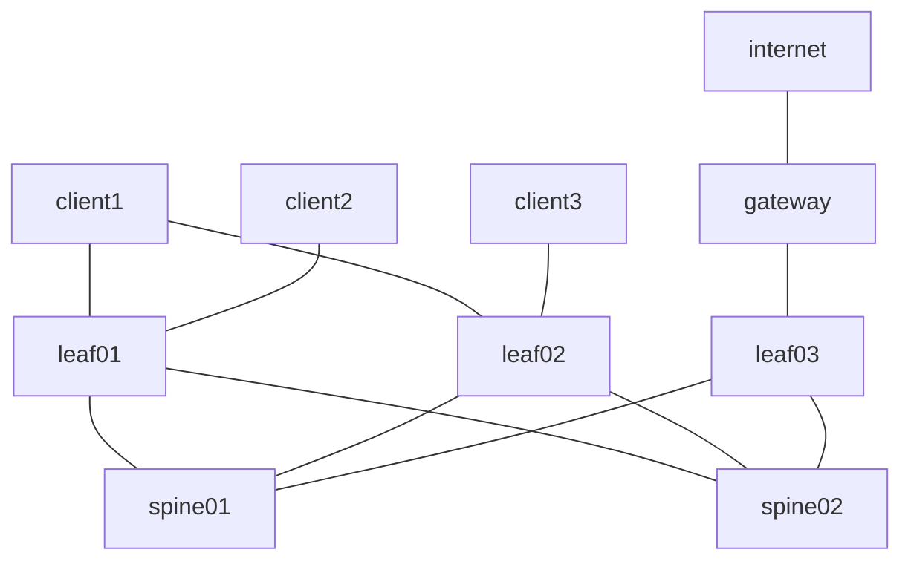

# clab-frr-evpn-vxlan - EVPN EBGP Over IPv4 EBGP WITH BRIDGED OVERLAY

## Overview

A three-stage Layer 3 Leaf/Spine (L3LS) EVPN fabric using [CONTAINERlab](https://containerlab.dev/) and [FRR](https://docs.frrouting.org/en/latest/index.html) nodes to demonstrate multi-tenant Layer 2 connectivity. The topology includes three clients: two clients (client1 and client3) belong to the same VNI/tenant (VNI 10), while a third client (client2) is part of a different VNI/tenant (VNI 20). Each tenant has its default gateway external to the fabric on a gateway router connected to the border leaf switch (leaf03). Based on the FRR [EVPN guide](https://docs.frrouting.org/en/latest/evpn.html), this setup focuses on L2VNI (MAC-VRF) connectivity in a Bridged Overlay (BO) design. The underlay connectivity is facilitated by eBGP/EVPN, and the overlay connectivity is facilitated by VXLAN.

## Requirements

- [CONTAINERlab](https://containerlab.dev/install/)
  - _The [CONTAINERlab](https://containerlab.dev/install/) installation guide outlines various installation methods. This lab assumes all [pre-requisites](https://containerlab.dev/install/#pre-requisites) (including Docker) are met and CONTAINERlab is installed via the [install script](https://containerlab.dev/install/#install-script)._
- Python 3

## Topology



## Resources

### IP Assignments

_The **Overlay/VTEP** assignments for spine01/spine02 are not actually implemented, or even required, since our VTEP's in this lab are on leaf01, leaf02, and leaf03. The assignments are therefore just for consistency purposes_

| Scope              | Network       | Sub-Network   | Assignment      | Name            |
| ------------------ | ------------- | ------------- | -------------   | --------------- |
| Management         | 172.28.1.0/24 |               | 172.28.1.2/24   | spine01         |
| Management         | 172.28.1.0/24 |               | 172.28.1.3/24   | spine02         |
| Management         | 172.28.1.0/24 |               | 172.28.1.4/24   | leaf01          |
| Management         | 172.28.1.0/24 |               | 172.28.1.5/24   | leaf02          |
| Management         | 172.28.1.0/24 |               | 172.28.1.6/24   | leaf03          |
| Management         | 172.28.1.0/24 |               | 172.28.1.7/24   | gateway         |
| Management         | 172.28.1.0/24 |               | 172.28.1.8/24   | client1         |
| Management         | 172.28.1.0/24 |               | 172.28.1.9/24   | client2         |
| Management         | 172.28.1.0/24 |               | 172.28.1.10/24  | client3         |
| Management         | 172.28.1.0/24 |               | 172.28.1.11/24  | internet        |
| Router ID (lo)     | 172.29.1.0/24 |               | 172.29.1.1/24   | spine01         |
| Router ID (lo)     | 172.29.1.0/24 |               | 172.29.1.2/24   | spine02         |
| Router ID (lo)     | 172.29.1.0/24 |               | 172.29.1.3/24   | leaf01          |
| Router ID (lo)     | 172.29.1.0/24 |               | 172.29.1.4/24   | leaf02          |
| Router ID (lo)     | 172.29.1.0/24 |               | 172.29.1.5/24   | leaf03          |
| Overlay/VTEP (lo1) | 172.30.1.0/24 |               | 172.30.1.1/24   | spine01         |
| Overlay/VTEP (lo1) | 172.30.1.0/24 |               | 172.30.1.2/24   | spine02         |
| Overlay/VTEP (lo1) | 172.30.1.0/24 |               | 172.30.1.3/24   | leaf01          |
| Overlay/VTEP (lo1) | 172.30.1.0/24 |               | 172.30.1.4/24   | leaf02          |
| Overlay/VTEP (lo1) | 172.30.1.0/24 |               | 172.30.1.5/24   | leaf03          |
| P2P Links          | 172.31.1.0/24 | 172.31.1.0/31 | 172.31.1.0/31   | spine01::leaf01 |
| P2P Links          | 172.31.1.0/24 | 172.31.1.0/31 | 172.31.1.1/31   | leaf01::spine01 |
| P2P Links          | 172.31.1.0/24 | 172.31.1.2/31 | 172.31.1.2/31   | spine01::leaf02 |
| P2P Links          | 172.31.1.0/24 | 172.31.1.2/31 | 172.31.1.3/31   | leaf02::spine01 |
| P2P Links          | 172.31.1.0/24 | 172.31.1.4/31 | 172.31.1.4/31   | spine02::leaf01 |
| P2P Links          | 172.31.1.0/24 | 172.31.1.4/31 | 172.31.1.5/31   | leaf01::spine02 |
| P2P Links          | 172.31.1.0/24 | 172.31.1.6/31 | 172.31.1.6/31   | spine02::leaf02 |
| P2P Links          | 172.31.1.0/24 | 172.31.1.6/31 | 172.31.1.7/31   | leaf02::spine02 |
| P2P Links          | 172.31.1.0/24 | 172.31.1.8/31 | 172.31.1.8/31   | spine01::leaf03 |
| P2P Links          | 172.31.1.0/24 | 172.31.1.8/31 | 172.31.1.9/31   | leaf03::spine01 |
| P2P Links          | 172.31.1.0/24 | 172.31.1.10/31 | 172.31.1.10/31 | spine02::leaf03 |
| P2P Links          | 172.31.1.0/24 | 172.31.1.10/31 | 172.31.1.11/31 | leaf03::spine02 |

### ASN Assignments

| ASN   | Device  |
| ----- | ------- |
| 65500 | spine01 |
| 65501 | spine02 |
| 65502 | leaf01  |
| 65503 | leaf02  |
| 65504 | leaf03  |

### VXLAN Segments

| vni | name | network      | leaf   | host    | host ip   | vlan | gateway   |
| --- | ---- | ------------ | ------ | ------- | --------- | ---- | --------- |
| 10  | RED  | 10.10.1.0/24 | leaf01 | client1 | 10.10.1.2 | 10   | 10.10.1.1 |
| 10  | RED  | 10.10.1.0/24 | leaf02 | client1 | 10.10.1.2 | 10   | 10.10.1.1 |
| 10  | RED  | 10.10.1.0/24 | leaf02 | client3 | 10.10.1.3 | 10   | 10.10.1.1 |
| 20  | BLUE | 10.20.1.0/24 | leaf01 | client2 | 10.20.1.1 | 20   | 10.20.1.1 |

## Deployment

Clone this repsoitory and start the lab

```shell
git clone https://github.com/dbono711/clab-frr-evpn-vxlan.git
cd clab-frr-evpn-vxlan
make all
```

**_NOTE: CONTAINERlab requires SUDO privileges in order to execute_**

- Initializes the ```setup.log``` file
- Creates the CONTAINERlab [network](setup.yml) based on the [topology definition](https://containerlab.dev/manual/topo-def-file/)
  - The FRR configuration is bound to the ```spine```, ```leaf``` and ```gateway``` nodes in the topology definition at startup
  - There is a shell script bound to all nodes in the topology definition at startup
    - The script configures the Linux-level Ethernet, Dummy, VXLAN, and Bridge interfaces; leaving the IP configuration to FRR

## Accessing the container CLI (SHELL)

The container CLI (SHELL) can be accessed by using the ```docker exec``` command, as follows:

```docker exec -it <container> bash```

For example, to access the CLI on the ```spine01``` container

```shell
$ docker exec -it clab-frr-evpn-vxlan-spine01 bash
bash-5.1#
```

## Accessing the container FRR CLI (VTYSH)

The container FRR CLI (VTYSH) can be accessed by using the ```docker exec``` command, as follows:

```docker exec -it <container> vtysh```

For example, to access the FRR CLI on the ```spine01``` container

```shell
$ docker exec -it clab-frr-evpn-vxlan-spine01 vtysh

Hello, this is FRRouting (version 8.4_git).
Copyright 1996-2005 Kunihiro Ishiguro, et al.

spine01#
```

## Validating Routing & Switching operation on FRR nodes

**_NOTE: All subsequent commands assume that you are able to access the FRR CLI (VTYSH) per [Accessing the container FRR CLI (VTYSH)](#accessing-the-container-frr-cli-vtysh)_**

### Displaying BGP tables

eBGP facilitates the underlay IPv4 connectivity and EVPN route exchange in the control plane for overlay connectivity between the ```spine``` and ```leaf``` FRR nodes. The design employs a multi-AS approach, assigning each spine/leaf its own ASN, utilizing both the ```ipv4 unicast``` and ```l2vpn evpn``` address families, as well as ```bgp as-path multipath-relax``` to allow for multiple paths to the same prefix

To ensure IPv4 unicast routes are being learned accordingly, execute the following command on any one node:

```show bgp ipv4 unicast```

Not considering the allocations for the node you are executing the command from, you should see all other respective [IP assignments](#ip-assignments) in the BGP ```ipv4 unicast```table. For example, if you are executing this command on ```leaf01```, you should see; the ```Router ID (lo)``` assignments from ```spine01```, ```spine02```,```leaf02``` and ```leaf03``` and the ```Overlay/VTEP (lo1)``` assignments from ```leaf02``` and ```leaf03```.

To ensure L2VPN EVPN routes are being learned accordingly, execute the following command on any one node:

```show bgp l2vpn evpn```

Not considering the allocations for the ```leaf``` node you are executing the command from, you should see the respective EVPN Type 2 and Type 3 routes. For example, if you are executing this command on ```leaf01```, you should see; the EVPN Type 3 route for 172.30.1.4 (the VTEP on ```leaf02```), and the EVPN Type 2 route for the MAC address of ```client2```, the EVPN Type 3 route for 172.30.1.5 (the VTEP on ```leaf03```), and the EVPN Type 2 route for the MAC address of ```client1```

### Displaying EVPN information

EVPN enables the signaling of the bridged (L2) VPNs over the fabric network, acting as the control plane for the transport of Ethernet frames. To display detailed information about MAC addresses for a specified VNI, execute the following command on the leaf nodes only as they are carrying the VTEP functionality in this fabric. For example, if you are executing this command on ```leaf01```, you should see the local MAC address learned from ```client1``` and the MAC address of ```client2```, learned remotely.

```show evpn mac vni 10```

```shell
leaf01# show evpn mac vni 10
Number of MACs (local and remote) known for this VNI: 3
Flags: N=sync-neighs, I=local-inactive, P=peer-active, X=peer-proxy
MAC               Type   Flags Intf/Remote ES/VTEP            VLAN  Seq #'s
aa:c1:ab:d5:0e:c9 remote       172.30.1.4                           0/0
aa:c1:ab:65:5a:f0 remote       172.30.1.5                           0/0
aa:c1:ab:94:5e:5d local        mhbond1.10                           3/2
```

### Client1 Ethernet Segment
Client1 is multi-homed to ```leaf01``` and ```leaf02```. Each of these ```leaf``` nodes have the same Ethernet segment configured on individual bond interfaces to the respective links on ```client1```

## Data Plane Validation

The [Makefile](Makefile) performs data plane validation by executing the [validate.py](validate.py) Python script which performs a PING from ```client1``` and ```client2``` to their default gateways on the gateway router attached to ```leaf03```. The script therefore leaves a lot of room for explanation for more advanced validation such as parsing JSON output from the FRR nodes, analyzing bridge fdb tables at the Linux level of the FRR and client nodes, etc.

## Cleanup

Stop the lab, tear down the CONTAINERlab containers

```shell
make clean
```

## Logging

All activity is logged to a file called ```setup.log``` at the root of the repository.

## Authors

- Darren Bono - [darren.bono@att.net](mailto://darren.bono@att.net)

## License

This project is licensed under the MIT License. See [LICENSE](LICENSE) for details
