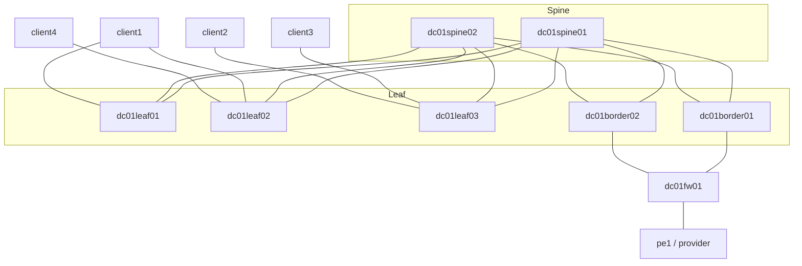
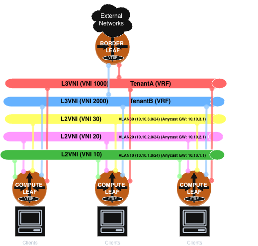

# EVPN iBGP over OSPF — Symmetric IRB (As-Built)

## Table of Contents

1. [Scope & Overview](#1-scope--overview)
2. [Requirements](#2-requirements)
3. [Physical Topology](#3-physical-topology)
4. [Addressing Plan](#4-addressing-plan)
5. [Underlay Design](#5-underlay-design)
6. [Overlay / EVPN Control-Plane Design](#6-overlay--evpn-control-plane-design)
7. [VXLAN / Data-Plane Design](#7-vxlan--data-plane-design)
8. [Tenant Design](#8-tenant-design)
9. [EVPN Multi-Homing](#9-evpn-multi-homing)
10. [Border Leaf & Egress Design](#10-border-leaf--egress-design)
11. [Firewall / Security-Zone Design](#11-firewall--security-zone-design)
12. [Provider Hand-off (Reference Only)](#12-provider-hand-off-reference-only)
13. [Observability & Monitoring Stack](#13-observability--monitoring-stack)
14. [Observations & Inconsistencies](#14-observations--inconsistencies)

---

## 1. Scope & Overview

The Datacenter design is a three-stage Layer 3 leaf/spine (Clos) fabric built on [CONTAINERlab](https://containerlab.dev/) using [FRRouting](https://frrouting.org/) `10.7.0` nodes. It delivers multi-tenant Layer 2 and Layer 3 connectivity over a BGP EVPN control plane with a VXLAN data plane, using a **symmetric IRB** (Integrated Routing and Bridging) design and distributed **anycast gateways**.

Even at three leaves and two border leaves, the design commits to full Clos discipline: every leaf home-runs to both spines, there is no leaf-to-leaf cabling, and there is no leaf-to-leaf BGP peering. This results in predictable ECMP, a leaf or spine failing without forcing any topology change on the survivors, and scale-out that means "cable in another leaf," not "redesign the fabric."

The single decision that shapes every other section in this document is **symmetric IRB with distributed anycast gateways**. Once every leaf hosting a given VLAN answers as the *identical* gateway IP and MAC, two consequences follow immediately, and they explain most of the "why" in the sections below:

1. The control plane's job stops being "tell every router about every other router" and becomes "tell every router where every host is", which is exactly what EVPN Type-2 routes do, and it's why route-reflection off two spines is sufficient instead of a leaf-to-leaf full mesh.
2. Anything that assumes routers are individually distinguishable — classic PIM's neighbor discovery and join/prune state machine being the sharpest example — stops working across the fabric without extra machinery, because there is no longer "the" gateway for a subnet, there are three of them answering identically. This is a known, deliberate trade-off of the anycast-IRB model. This is why any future multicast-routing design for this fabric has to be solved at the BGP control-plane layer rather (i.e., "TRM") than by simply enabling `pim`.

| Role | Nodes | Function |
| ---- | ----- | -------- |
| Spine | `dc01spine01`, `dc01spine02` | Underlay transit; EVPN route-reflectors |
| Compute leaf (VTEP) | `dc01leaf01`, `dc01leaf02`, `dc01leaf03` | Host attachment; VXLAN tunnel endpoints; anycast gateways |
| Border leaf (VTEP) | `dc01border01`, `dc01border02` | L3-only VTEPs; redundant egress toward firewall |
| Firewall | `dc01fw01` | FRR router simulating per-tenant security zones (policy chokepoint); also owns the `Outside` VRF and the provider peering |
| Clients | `client1`–`client4` | Tenant workloads |
| Provider edge | `pe1` | "The provider" — Internet / default-route source (reference only) |

The spine layer carries no VTEP function; VXLAN encapsulation/decapsulation happens exclusively on the leaves and the border leaves. Keeping spines VXLAN-unaware means spines never need to know about VNIs, tenants, or anycast MACs at all, so adding a tenant or a VLAN never touches the spine layer.

Two border leaves exist because a single border leaf is a single point of failure for every tenant's egress path. Border leaves carry no L2VNI (§10), so §1's anycast-gateway redundancy story doesn't cover them, and EVPN multi-homing — the fabric's other redundancy mechanism, used for `client1` in §9 — is confirmed non-functional in this containerlab environment (§9, §14). Redundancy here is instead achieved with plain BGP/EVPN multipath ECMP: both border leaves independently originate the same tenant subnets and default route as EVPN Type-5, so every compute leaf simply sees two equal-cost paths and load-balances or fails over between them without either border leaf needing to know the other exists. See §10 for the mechanics.

---

## 2. Requirements

Each requirement below reflects a real operational concern a production DC design has to answer.

| # | Requirement | Design mechanism |
| - | ----------- | ---------------- |
| R1 | Extend Layer 2 segments across any leaf in the fabric | L2VNIs (VXLAN) signalled by EVPN Type-2/Type-3 routes |
| R2 | Provide a distributed, optimal first-hop gateway for every subnet | Anycast gateway — identical SVI IP + MAC on every VTEP hosting the VLAN |
| R3 | Route between subnets within a tenant without hair-pinning | Symmetric IRB via a per-tenant L3VNI |
| R4 | Keep tenants isolated in the routing plane | One VRF (and one L3VNI) per tenant |
| R5 | Survive a single leaf or link failure for critical hosts | EVPN multi-homing (client1 dual-homed to leaf01/leaf02); dual spines with ECMP |
| R6 | Force inter-tenant and Internet-bound traffic through a policy chokepoint | Border leaf + firewall ("VRF sandwich"); no direct inter-VRF route leaking in the fabric |
| R7 | Reach the Internet via an external provider | Firewall `Outside` VRF, eBGP to `pe1`, default route injected into tenants; dual border leaves for redundant egress transit (ECMP, not EVPN-MH) |

**Why these, specifically:**

- **R1/R2** exist because workload placement in a real DC is not static — a host (or, in production, a VM/container) can come up behind any leaf, and the network shouldn't be the reason it can't. Anycast gateway means "which leaf is this host on" stops being a question the network needs an answer to.
- **R3** is what makes symmetric IRB worth choosing over the simpler asymmetric IRB model: asymmetric IRB requires every VTEP to hold every L2VNI it might ever need to route into, which doesn't scale past a handful of VLANs. Symmetric IRB trades a small amount of extra hops (route in, cross the L3VNI, route out) for transit nodes never needing L2VNI state at all — see §10, where this is exactly why `dc01border01` can be an L3-only VTEP.
- **R4** is a blast-radius requirement as much as a routing one: a misconfiguration or a compromised host in TenantA should not even have a route to TenantB to exploit, not just be blocked by a firewall rule.
- **R5** targets access-layer redundancy specifically — R2's anycast gateway already makes the *routing* resilient to a leaf failing, but a single-homed host's *link* is still a single point of failure. R5 is why client1, and only client1, gets EVPN multi-homing (§9) as the contrast case against the other three single-homed clients.
- **R6** is a compliance/blast-radius concern before it's a routing preference: "no direct inter-VRF route leaking in the fabric" means the only place a packet can cross from TenantA to TenantB, or out to the Internet, is a device whose entire job is enforcing that policy — not a configuration convention that any future change could quietly bypass.
- **R7** is deliberately minimal — a single eBGP peer and a `default-originate` — because modeling "the Internet" isn't the point of this fabric; having a believable, working egress path is (§12). The choice of plain BGP/EVPN ECMP over the two border leaves, rather than EVPN-MH, isn't a preference — it's a direct consequence of §9's and §14's findings that EVPN-MH's dataplane enforcement is non-functional on this platform (containerlab's `veth` links can't support the kernel `protodown` behavior it depends on).

---

## 3. Physical Topology

`dc01border01` and `dc01border02` are cabled identically to the compute leaves at the underlay layer — dual-homed to both spines, same OSPF adjacency pattern — but are architecturally a different kind of node. Meaning, neither has any directly attached hosts, and every packet either forwards is either entering or leaving the fabric's tenant address space. Keeping that role physically and functionally separate from the compute leaves means egress policy changes never risk touching a host-facing fast path, and a compute leaf can be added, removed, or reimaged without anyone needing to reason about egress at all. The two border leaves are structurally identical to each other as well — see §10 for why that symmetry is what makes plain ECMP sufficient for egress redundancy.

Physical links (from `lab.yml`):

| A end | B end | Purpose |
| ----- | ----- | ------- |
| dc01spine01:eth1 | dc01leaf01:eth1 | Underlay |
| dc01spine01:eth2 | dc01leaf02:eth1 | Underlay |
| dc01spine01:eth3 | dc01leaf03:eth1 | Underlay |
| dc01spine01:eth4 | dc01border01:eth1 | Underlay |
| dc01spine01:eth5 | dc01border02:eth1 | Underlay |
| dc01spine02:eth1 | dc01leaf01:eth2 | Underlay |
| dc01spine02:eth2 | dc01leaf02:eth2 | Underlay |
| dc01spine02:eth3 | dc01leaf03:eth2 | Underlay |
| dc01spine02:eth4 | dc01border01:eth2 | Underlay |
| dc01spine02:eth5 | dc01border02:eth2 | Underlay |
| dc01leaf01:eth3 | client1:eth1 | Host (multi-homed) |
| dc01leaf02:eth3 | client1:eth2 | Host (multi-homed) |
| dc01leaf03:eth3 | client3:eth1 | Host (VLAN 10) |
| dc01leaf03:eth4 | client2:eth1 | Host (VLAN 20) |
| dc01leaf02:eth4 | client4:eth1 | Host (VLAN 30) |
| dc01border01:eth5 | dc01fw01:eth1 | Firewall inside leg (trunk: TenantA/TenantB) |
| dc01border02:eth5 | dc01fw01:eth3 | Firewall inside leg (trunk: TenantA/TenantB) |
| dc01fw01:eth2 | pe1:eth1 | Provider (Internet) |

### Tenant High-Level

---

## 4. Addressing Plan

### Management — `192.168.1.0/24`

| Node | Mgmt IP |
| ---- | ------- |
| dc01spine01 | 192.168.1.2 |
| dc01spine02 | 192.168.1.3 |
| dc01leaf01 | 192.168.1.4 |
| dc01leaf02 | 192.168.1.5 |
| dc01leaf03 | 192.168.1.6 |
| dc01border01 | 192.168.1.7 |
| dc01border02 | 192.168.1.8 |
| dc01fw01 | 192.168.1.9 |
| client1 | 192.168.1.10 |
| client2 | 192.168.1.11 |
| client3 | 192.168.1.12 |
| client4 | 192.168.1.13 |
| pe1 | 192.168.1.41 |

### Router-IDs / loopbacks (`lo`) — `172.29.1.0/24`

`lo` is the node's control-plane identity: BGP router-ID, OSPF router-ID, and the source address for the overlay's iBGP sessions (`update-source lo`) all key off it.

| Node | Router-ID |
| ---- | --------- |
| dc01spine01 | 172.29.1.1 |
| dc01spine02 | 172.29.1.2 |
| dc01leaf01 | 172.29.1.3 |
| dc01leaf02 | 172.29.1.4 |
| dc01leaf03 | 172.29.1.5 |
| dc01border01 | 172.29.1.6 |
| dc01border02 | 172.29.1.7 |
| dc01fw01 | 172.29.1.8 |

### VTEP source loopbacks (`lo1`) — `172.30.1.0/24`

`lo1` exists as a second, separate loopback purely because VXLAN needs a stable tunnel source/destination address, and that address deliberately isn't the same one BGP/OSPF use for control-plane identity. Splitting them means the VXLAN data plane and the BGP/OSPF control plane don't fate-share on the same address — a `lo` renumber or router-ID change never has to be coordinated with anything about active VXLAN tunnels, and a VTEP address is never ambiguous with a router-ID in a debugging session.

| Node | VTEP IP |
| ---- | ------- |
| dc01leaf01 | 172.30.1.3 |
| dc01leaf02 | 172.30.1.4 |
| dc01leaf03 | 172.30.1.5 |
| dc01border01 | 172.30.1.6 |
| dc01border02 | 172.30.1.7 |

### Underlay point-to-point links — `172.16.1.0/24` (/31s)

| Link | Spine side | Leaf/Border side |
| ---- | ---------- | ---------------- |
| spine01 ↔ leaf01 | 172.16.1.0 | 172.16.1.1 |
| spine01 ↔ leaf02 | 172.16.1.2 | 172.16.1.3 |
| spine01 ↔ leaf03 | 172.16.1.4 | 172.16.1.5 |
| spine02 ↔ leaf01 | 172.16.1.6 | 172.16.1.7 |
| spine02 ↔ leaf02 | 172.16.1.8 | 172.16.1.9 |
| spine02 ↔ leaf03 | 172.16.1.10 | 172.16.1.11 |
| spine01 ↔ border01 | 172.16.1.12 | 172.16.1.13 |
| spine02 ↔ border01 | 172.16.1.14 | 172.16.1.15 |
| spine01 ↔ border02 | 172.16.1.22 | 172.16.1.23 |
| spine02 ↔ border02 | 172.16.1.24 | 172.16.1.25 |

### Border ↔ firewall links — `172.16.1.0/24` (/31s)

| Link | Border side | FW01 side | VRF |
| ---- | ----------- | --------- | --- |
| border01 TenantA inside | 172.16.1.16 (eth5.1000) | 172.16.1.17 (eth1.1000) | TenantA |
| border01 TenantB inside | 172.16.1.18 (eth5.2000) | 172.16.1.19 (eth1.2000) | TenantB |
| border02 TenantA inside | 172.16.1.26 (eth5.1000) | 172.16.1.27 (eth3.1000) | TenantA |
| border02 TenantB inside | 172.16.1.28 (eth5.2000) | 172.16.1.29 (eth3.2000) | TenantB |

### Provider link — `10.100.1.8/30`

`dc01fw01` peers with `pe1` directly — the `Outside` VRF now lives on the firewall, not a border leaf (§10).

| Node | IP |
| ---- | -- |
| dc01fw01 (eth2) | 10.100.1.10 |
| pe1 (eth1) | 10.100.1.9 |

### Route-distinguisher / route-target scheme

Two independent numbering schemes are deliberately used together:

- **RD = `<router-id>:<VNI>`** — unique per (node, VNI) pair, since RFC 4364 requires RDs to be globally unique so that identical prefixes advertised from different VTEPs don't collide in BGP's best-path selection. Keying it off the router-id already assigned per node means no separate RD allocation scheme is needed.
- **RT = flat `65999:<VNI>`**, shared fabric-wide and deliberately decoupled from the fabric's actual BGP ASN (`65000`). Route-targets are what control *import/export* — every VTEP that should participate in a given VNI imports/exports that VNI's RT, regardless of which node originated the route. Using a constant, ASN-independent RT number means the RT scheme survives an ASN renumber untouched, and makes it visually obvious in `show bgp l2vpn evpn` output which RTs are fabric policy (`65999:*`) versus anything route-leaked from outside (§10, §11). This scheme is applied uniformly to both L2VNIs and L3VNIs, and is explicitly configured on every VTEP — no node's import/export behavior relies on FRR's auto-derived defaults.

---

## 5. Underlay Design

The underlay provides plain IPv4 reachability between all loopbacks so the overlay's BGP sessions and VXLAN tunnels have an IP substrate. Its only job is loopback-to-loopback reachability. The underlay never needs to change when a tenant, VLAN, or policy changes.

- **Protocol:** OSPFv2, single area `0.0.0.0`.
- **Links:** every spine–leaf and spine–border fabric link runs `ip ospf network point-to-point` over a /31, eliminating DR/BDR election. A Clos fabric link is definitionally a two-router segment — there is never a third router to elect a designated router against — so DR/BDR election has no job to do here and only adds convergence time and a state machine with no purpose. Declaring the link type explicitly removes it.
- **Loopbacks:** `lo` (router-ID) and `lo1` (VTEP) are advertised into OSPF and marked `ip ospf passive`. Passive means the prefix is injected into OSPF's LSAs for reachability, but OSPF never attempts to form a neighbor adjacency over that interface — correct, since a loopback has no neighbor to adjacency with in the first place. The VTEP loopbacks (`172.30.1.x/32`) must be reachable fabric-wide because they are the VXLAN tunnel source/destination addresses; if `lo1` reachability breaks, VXLAN tunnels to that node break with it, independent of whether BGP/OSPF control-plane reachability (`lo`) is still fine.
- **IPv6:** disabled (`no ipv6 forwarding` in FRR; `disable_ipv6` sysctls in the shell scripts). The fabric is IPv4-only end to end — there's no dual-stack requirement here, and disabling IPv6 outright avoids link-local address generation and router-solicitation noise on every interface for a protocol family nothing in this design uses.

---

## 6. Overlay / EVPN Control-Plane Design

- **Protocol:** iBGP, single autonomous system **AS 65000** for the entire DC01 fabric.
- **Address family:** `l2vpn evpn` only (there is no `ipv4 unicast` overlay AF — host/prefix reachability is carried inside EVPN).
- **Route reflection:** both spines are route-reflectors. Each spine marks its `OVERLAY` peer-group `route-reflector-client` and carries `advertise-all-vni`. Leaves and the border leaves peer **only** to the two spine loopbacks (`172.29.1.1`, `172.29.1.2`) — there is no leaf-to-leaf peering.
- **Peering parameters (leaves/border):** `neighbor OVERLAY remote-as internal`, `update-source lo`, `bgp bestpath as-path multipath-relax`, `no bgp default ipv4-unicast`.

Route-reflection off the two spines is a direct consequence of where the spines already sit physically. Meaning, every leaf already has a link to both spines for the underlay, so using those same two nodes as the overlay's route-reflectors adds no new peering relationships, and keeps the peering count at *n* (one leaf, two spine sessions) instead of the *n²* a full mesh would need as leaves are added. Dual spines as RRs also means either one can fail without partitioning the overlay — every leaf still has one working RR session.

`l2vpn evpn` being the *only* overlay address family (`no bgp default ipv4-unicast` is set explicitly to prevent FRR's default auto-activation of `ipv4 unicast`) reflects that this fabric never needs a parallel plain-IPv4 overlay. Every piece of host and prefix reachability that matters is already expressed as an EVPN route.

- **EVPN route types in use:**
  - **Type 2 (MAC/IP):** host MAC and MAC+IP advertisements; also drives the per-host `/32` entries installed into tenant VRFs for symmetric IRB. This is the route type that makes anycast gateways viable for unicast at all — it re-expresses "where is this host" as "which VTEP originated this route," so an ingress leaf never needs to know or care that the destination's gateway identity is shared across three leaves; it only needs to know which one specific VTEP actually holds that MAC/IP right now.
  - **Type 3 (IMET):** per-VNI flood-list construction for BUM traffic (ingress replication / head-end replication). Every VTEP that imports a VNI's RT and originates a Type-3 route for it becomes a member of that VNI's flood list, which is how an ingress VTEP knows the full set of remote VTEPs to head-end-replicate a BUM frame to.
  - **Type 4 (Ethernet Segment):** multi-homing / Designated-Forwarder election for the dual-homed `client1` — see §9 for the full mechanics and why this needs to be a distinct route type rather than something LACP alone can express.
  - **Type 5 (IP Prefix):** routed prefixes (SVI subnets, default route) advertised out of tenant VRFs. This is the mechanism that lets a VRF's routed prefixes — including the default route originated at both border leaves, §10 — cross the fabric without a second, parallel routing protocol; it rides the same iBGP sessions and route-reflector topology as everything else in this list.

---

## 7. VXLAN / Data-Plane Design

The data plane is built with native Linux bridges and VXLAN interfaces in the per-node shell scripts; FRR programs the forwarding state from EVPN.

- **Encapsulation:** VXLAN, UDP destination port **4789**, tunnel source = `lo1` (`172.30.1.x`).
- **`nolearning`:** every VXLAN interface is created with `nolearning`, so the bridge FDB is populated exclusively from the BGP EVPN control plane (Type-2), not from data-plane flooding. This is the deliberate departure from classic "flood-and-learn" VXLAN, where a VTEP learns remote MACs by observing traffic arrive over the tunnel — that approach requires BUM flooding to work correctly just to bootstrap MAC learning. With `nolearning`, the FDB is exactly what BGP says it is, nothing more; a MAC that hasn't been advertised via Type-2 simply isn't reachable, which is a stricter but far more predictable failure mode than "learn from whatever data-plane traffic happens to arrive first."
- **ARP/ND suppression:** access-facing L2VNI ports are set `neigh_suppress on`, so leaves answer ARP locally from the EVPN-learned neighbor table instead of flooding across the fabric. This is the same logic as `nolearning` applied one layer up — since Type-2 already carries the MAC+IP pair, there's no reason to let an ARP request go find that answer the slow way when the local VTEP already has it.
- **Symmetric IRB:** inter-subnet traffic within a tenant is routed into the tenant VRF and carried across the fabric inside that tenant's dedicated **L3VNI**, then routed into the destination L2VNI at the egress VTEP. Transit/border nodes therefore only need the L3VNI, not every L2VNI — which is precisely why `dc01border01` (§10) can be an L3-only VTEP with zero local L2VNI state despite participating in every tenant's routed traffic.
- **Anycast gateway:** each VLAN's SVI (`brXX`) is given the **same** IP and the **same** MAC on every VTEP that hosts it, so a host's default-gateway ARP entry stays valid regardless of which leaf it is attached to.

### Symmetric vs. asymmetric IRB: why this fabric routes twice

The difference between the two IRB models comes down to how many times a packet gets routed on its way across the fabric, and that difference is what decides how much VNI state every VTEP has to carry. It's worth walking through both explicitly, using this fabric's own client1 (VLAN 10, `dc01leaf01`/`dc01leaf02`) → client2 (VLAN 20, `dc01leaf03`) path as the concrete example — the same tenant, two different subnets, one hop across the fabric.

**Asymmetric IRB — "bridge-route-bridge."** This is *not* what this fabric uses, but it's the natural first design and worth contrasting against. The ingress VTEP does the entire job by itself:

1. **Bridge** — client1's frame arrives at the ingress leaf's access port and gets bridged into the local VLAN 10 domain, hitting the SVI.
2. **Route** — the ingress leaf looks up client2's IP in its VRF table, rewrites the destination MAC to client2's actual MAC, and — this is the defining trait of asymmetric IRB — encapsulates the now-routed frame directly into **VNI 20**, client2's own L2VNI, and sends it straight to the egress VTEP.
3. **Bridge** — the egress VTEP receives a frame already tagged with VNI 20 and just bridges it out locally. No routing happens at the egress side at all; the ingress VTEP already did all of it.

The catch: step 2 only works if the *ingress* VTEP has VNI 20 provisioned locally, even though it has no client2 host anywhere near it. Generalized across a tenant with N subnets, every VTEP that needs to route for that tenant needs all N L2VNIs configured, everywhere, whether or not it has a host on most of them. That's the scaling wall symmetric IRB exists to remove.

**Symmetric IRB — "bridge-route-route-bridge."** This is what's actually configured here. Routing is split into two separate hops, one on each side of the fabric crossing, joined by a **shared, tenant-wide L3VNI** instead of the destination's specific L2VNI:

1. **Bridge** — same as above: client1's frame is bridged locally into VLAN 10 at the ingress leaf, hitting the SVI.
2. **Route (ingress)** — the ingress leaf routes toward client2's IP, but instead of needing to know VNI 20 exists, it encapsulates into TenantA's **L3VNI (1000)** — a VNI every TenantA VTEP already carries regardless of which VLANs it hosts — and rewrites the inner destination MAC not to client2's MAC, but to the **egress VTEP's own Router MAC (RMAC)**. That RMAC substitution, carried via the Router's MAC extended community on the EVPN route that resolved this path, is the actual signal that tells the egress VTEP "this frame needs routing, not a bridge lookup" the moment it decapsulates it.
3. **Route (egress)** — `dc01leaf03` decapsulates the VNI-1000 frame, sees its own RMAC as the inner destination, and performs the *second* routing lookup itself — using its own local Type-2-learned host route for client2 to rewrite the destination MAC to client2's real MAC and identify VNI 20 as the outbound L2VNI.
4. **Bridge** — the now-correctly-addressed frame is bridged out to client2's access port.

The payoff is exactly what §7's `nolearning`/anycast-gateway points already lean on and what §10 depends on directly: because the ingress side only ever needs to know the *L3VNI*, never the destination's specific L2VNI, a transit or border node can route for a tenant while carrying zero L2VNI state for it. That's precisely why `dc01border01` gets away with being an L3-only VTEP (§10) — it only ever participates in the shared L3VNI per tenant, and the "second route" hop always happens at whichever leaf actually hosts the destination, which is the one node in the fabric guaranteed to already have that L2VNI provisioned locally. The extra routing hop is the price paid for decoupling "who can route for this tenant" from "who has to know every subnet in it."

### L2VNI / L3VNI / RD / RT matrix (as configured)

| Node | L2VNI (RD / RT) | L3VNI VRF (RD / RT) |
| ---- | --------------- | -------------------- |
| dc01leaf01 | VNI 10 → rd `172.29.1.3:10`, rt `65999:10` | TenantA → rd `172.29.1.3:1000`, rt `65999:1000` |
| dc01leaf02 | VNI 10 → rd `172.29.1.4:10`, rt `65999:10`; VNI 30 → rd `172.29.1.4:30`, rt `65999:30` | TenantA → rd `172.29.1.4:1000`, rt `65999:1000`; TenantB → rd `172.29.1.4:2000`, rt `65999:2000` |
| dc01leaf03 | VNI 10 → rd `172.29.1.5:10`, rt `65999:10`; VNI 20 → rd `172.29.1.5:20`, rt `65999:20` | TenantA → rd `172.29.1.5:1000`, rt `65999:1000` |
| dc01border01 | none (L3-only VTEP) | TenantA → rd `172.29.1.6:1000`, rt `65999:1000`; TenantB → rd `172.29.1.6:2000`, rt `65999:2000` |
| dc01border02 | none (L3-only VTEP) | TenantA → rd `172.29.1.7:1000`, rt `65999:1000`; TenantB → rd `172.29.1.7:2000`, rt `65999:2000` |

Every RD in this table follows the same `<router-id>:<VNI>` scheme described in §4, and every L3VNI RT now follows the same `65999:<VNI>` scheme already used for L2VNIs — TenantA's L3VNI (1000) is `65999:1000` everywhere it's configured, TenantB's (2000) is `65999:2000`. Both are explicit on every VTEP, including `dc01border01`, which previously relied on FRR's auto-derived RD and a wildcard (`*:VNI`) auto-derived RT for its L3VNI bindings — replaced here with the same explicit convention used fabric-wide, so no node's EVPN import/export behavior depends on an implicit default.

---

## 8. Tenant Design

Two tenants are defined, each mapped to its own VRF (Linux routing table) and its own L3VNI. Route-targets use a shared `65999:<VNI>` scheme, decoupled from the fabric's BGP ASN.

The actual tenant isolation boundary here is the **VRF**, not the VLAN. VLANs (and their L2VNIs) are how a given tenant's *own* L2 segments are told apart from each other — TenantA's VLAN 10 versus its VLAN 20 — but two different tenants are told apart by which VRF (and which L3VNI) their traffic is routed through. This distinction matters operationally: adding a new VLAN to an existing tenant is a same-VRF change, while adding a new tenant is a new-VRF, new-L3VNI change with an entirely separate routing table — the two operations are not the same shape of change, and shouldn't be treated as one.

### TenantA — VRF table 100, L3VNI 1000

| VLAN / VNI | Subnet | Anycast GW | Anycast MAC | L2 RT | Hosted on |
| ---------- | ------ | ---------- | ----------- | ----- | --------- |
| 10 / 10 | 10.10.1.0/24 | 10.10.1.1 | aa:bb:cc:dd:00:01 | 65999:10 | leaf01, leaf02, leaf03 |
| 20 / 20 | 10.10.2.0/24 | 10.10.2.1 | aa:bb:cc:dd:00:02 | 65999:20 | leaf03 |

### TenantB — VRF table 200, L3VNI 2000

| VLAN / VNI | Subnet | Anycast GW | Anycast MAC | L2 RT | Hosted on |
| ---------- | ------ | ---------- | ----------- | ----- | --------- |
| 30 / 30 | 10.10.3.0/24 | 10.10.3.1 | aa:bb:cc:dd:00:03 | 65999:30 | leaf02 |

The anycast MAC scheme (`aa:bb:cc:dd:00:0<N>`) increments per VLAN index rather than per tenant, so VLAN 10/20/30's gateway MACs are `:01`/`:02`/`:03` regardless of which tenant they belong to — a deliberate, simple, collision-free allocation rather than anything tenant-derived.

### Client placement

| Client | Address | Tenant / VLAN | Attachment |
| ------ | ------- | ------------- | ---------- |
| client1 | 10.10.1.2/24 | TenantA / VLAN 10 | **Multi-homed** to leaf01 + leaf02 (LACP bond) — see [§9](#9-evpn-multi-homing) |
| client3 | 10.10.1.3/24 | TenantA / VLAN 10 | Single-homed to leaf03 |
| client2 | 10.10.2.2/24 | TenantA / VLAN 20 | Single-homed to leaf03 |
| client4 | 10.10.3.2/24 | TenantB / VLAN 30 | Single-homed to leaf02 |

Each client sets its default route to its VLAN's anycast gateway (`10.10.x.1`).

---

## 9. EVPN Multi-Homing

`client1` is the only client in this fabric that is dual-homed, and it exists specifically as the contrast case against `client2`/`client3`/`client4`'s single-homed attachment — the design deliberately includes both patterns side by side so the redundancy trade-off is visible rather than implied.

It's worth being precise about *which* failure this actually protects against, because it's easy to conflate with something the anycast gateway already handles. R2's anycast gateway already makes the fabric's *routing* resilient to a leaf disappearing — if `dc01leaf03` went down, every other leaf hosting VLAN 10/20 keeps answering as the same gateway, and nothing about reachability to *other* hosts changes. What anycast gateway does **not** fix is a single-homed host's own access link: if `client3`'s one physical link to `dc01leaf03` goes down (or `dc01leaf03` itself does), `client3` is off the network, full stop, regardless of how healthy the rest of the fabric is. That is a different failure domain — the *access* link, not the *gateway* — and it's the one R5 and EVPN multi-homing exist to close, for whichever hosts are judged critical enough to warrant the extra port and cabling. `client1` is that host here; the other three are intentionally left single-homed as the baseline this is being compared against.

Plain LACP bonding isn't sufficient on its own to solve this in a fabric context, because the two members of `client1`'s bond terminate on two *different, independent* physical switches (`dc01leaf01` and `dc01leaf02`) rather than one chassis. Ordinary LACP assumes both ends of the bond are the same device; here, the "far end" is actually two separate VTEPs that have to independently agree on a single, consistent forwarding decision for that bond, or `client1` would see duplicate BUM traffic — both leaves would otherwise each believe they're the sole path to `client1` and both flood accordingly. EVPN's multi-homing extension exists to solve exactly that coordination problem between two otherwise-independent VTEPs.

`client1` is dual-homed to `dc01leaf01` and `dc01leaf02` via an LACP bond. Both leaves share the same Ethernet Segment on `mhbond1`:

- ES-ID: `1`
- ES system MAC: `aa:aa:39:00:00:01`
- DF preference: `101`

The **ES-ID** is the shared key that tells `dc01leaf01` and `dc01leaf02` they are two legs of the *same* logical segment rather than two independent access ports that happen to both connect to something named `client1` — everything else about multi-homing coordination (DF election, split-horizon for BUM) is scoped to that shared ES-ID. FRR advertises the segment via EVPN **Type-4** routes, which is how each leaf learns that a peer leaf shares its ES-ID and needs to be included in DF election, without either leaf needing a direct, dedicated peering session to the other.

The **DF preference** (`101`, identical on both leaves) drives the **Designated-Forwarder** election that decides which one leaf actually forwards BUM traffic to `client1` at any given moment — without a DF, both leaves would deliver every broadcast/unknown-unicast/multicast frame to `client1` independently, since both have a valid local path to it. Using an explicit, configured DF preference rather than FRR's older hash-based default would give deterministic, predictable DF placement instead of an outcome that depends on ES-ID/VNI hash arithmetic. Identical preference on both leaves is not a gap, either: [RFC 9785](https://datatracker.ietf.org/doc/html/rfc9785) defines a deterministic tiebreak for equal preference — lowest originating IP wins — so election would still resolve cleanly (to `dc01leaf01`, `172.30.1.3` < `172.30.1.4`) even without differentiated values.

### Confirmed limitation: non-DF dataplane suppression does not work in this environment

The control-plane side of this setup is correct and does exactly what it's supposed to: `dc01leaf01` and `dc01leaf02` see each other via Type-4 routes, and the DF-preference/ES-ID configuration is exactly what upstream FRR guidance recommends for this bond-plus-VLAN-subinterface-plus-per-VLAN-bridge topology. What doesn't work is the dataplane enforcement layer underneath it:

- `show evpn es detail` on both leaves reports `VNI Count: 0` — the ES is never associated with VNI 10 — and `show bgp l2vpn evpn route type ead` returns zero Type-1 (Ethernet A-D) routes on either leaf. Without Type-1, there's no aliasing signal for remote leaves to ECMP unicast traffic across both ES legs, and DF election has no per-(ES,VNI) scope to run against — both leaves independently report `DF status: df` simultaneously (split-brain) rather than a real election resolving to one winner. Live multicast testing confirmed the practical consequence directly: **exactly two copies of every BUM frame are delivered to `client1`.**
- The root cause traces cleanly through zebra's own debug log (`debug zebra evpn mh es` is already enabled in `dc01leaf01/frr.conf`): zebra's EVPN-MH implementation depends on the kernel's `protodown` (`IFLA_PROTO_DOWN`) attribute to complete its startup hold-down sequence and to enforce non-DF suppression in the dataplane. The log shows zebra attempting to clear `protodown` on the bond member interface and the kernel rejecting the netlink call outright: `Extended Error: Protodown not supported by device`.
- This is a **platform limitation, not a version or config problem**. Checking the current mainline kernel source directly (`drivers/net/veth.c`) confirms `veth`'s `net_device_ops` has no `ndo_change_proto_down` entry at all — it has never implemented this hook, in any kernel version. Since containerlab's `linux`-kind nodes always connect over veth pairs, this can't be fixed by a newer kernel, a different host, or a newer FRR release (this fabric already runs current FRR 10.7.0). It's compounded by an independently-confirmed, still-open upstream defect ([FRRouting/frr#15400](https://github.com/FRRouting/frr/issues/15400)) showing that FRR's non-DF filter-install path doesn't actually get consumed by any dataplane backend even where `protodown` is supported.
- **Second confirmed symptom — continuous MAC-move churn, not just duplicate BUM.** Packet capture on `dc01leaf01`'s BGP session(s) to both spines, taken while running an ordinary `client1 → client2` ping, shows the same Type-2 (MAC-only) route for `client1`'s MAC repeatedly withdrawn and re-advertised, alternating origin RD between `dc01leaf01` (`172.29.1.3:10`) and `dc01leaf02` (`172.29.1.4:10`) — each leaf periodically claiming the MAC as freshly, locally learned. This isn't inferred from timing alone: every cycle carries the RFC 7432 MAC Mobility extended community, and its sequence number increments by exactly 1 on each cycle (observed `69 → 70 → 71` within a few seconds), which is the wire-level counter EVPN uses specifically to track MAC moves. The churn starts when the ping starts and stops when it stops. This is the same root cause as the duplicate-BUM finding, not a separate defect: with DF/aliasing coordination non-functional, neither leaf has a way to know the other also legitimately serves this ES, so each treats traffic it receives from `client1` as a new local origination and fights the other for ownership of the MAC.
- **Practical implication:** this fabric's EVPN-MH deployment can prove the control-plane mechanics are correctly designed and configured, but cannot be used to validate dataplane duplicate-suppression in this containerlab environment. Treat `client1`'s multi-homing as a demonstration of ES/DF-election configuration, not as evidence that BUM traffic is actually deduplicated end to end here — and expect visible BGP UPDATE churn, not just silent duplication, whenever `client1` is active.

---

## 10. Border Leaf & Egress Design

`dc01border01` and `dc01border02` are both VTEPs that carry **no local L2VNI** — neither has any directly attached hosts. Each participates in each tenant only at Layer 3 via the tenant L3VNI (VNI 1000 for TenantA, VNI 2000 for TenantB), making both of them pure transit/egress nodes for routed tenant traffic. This is the direct payoff of choosing symmetric IRB in §7: because inter-subnet traffic is already routed into the L3VNI at the *ingress* leaf, a transit/egress node downstream never needs to know anything about individual VLANs or L2VNIs at all — only the L3VNI, and only for the tenants it needs to hand off.

The two border leaves are **structurally identical**: same tenant statics, same redistribution route-maps, same per-VRF OSPF adjacency pattern to the firewall, just different next-hop and interface addressing. Neither is a designated primary — there is no active/standby state anywhere in this design, which is exactly what makes plain ECMP sufficient for the redundancy story in §1/§2: with two symmetric originators of the same routes, there's no coordination protocol needed to decide who's "in charge" the way VRRP or EVPN-MH would require. BGP's own multipath selection does all the work.

Egress path construction happens as a three-part sequence, each part solving a different piece of "how does a packet actually leave a tenant VRF":

1. **Static default per tenant on each border, redistributed fabric-wide.** A static `ip route 0.0.0.0/0 <fw-inside>` in each tenant VRF on **both** `dc01border01` (TenantA → `172.16.1.17`, TenantB → `172.16.1.19`) and `dc01border02` (TenantA → `172.16.1.27`, TenantB → `172.16.1.29`) points at the corresponding firewall inside leg — the one, deliberately unambiguous next hop for anything a tenant VRF doesn't have a more specific route for. Each static route is redistributed into that border's own tenant BGP instance via an explicit `TENANTA-OSPF-REDIST` / `TENANTB-OSPF-REDIST` route-map (permit only the tenant's own `/24` subnets learned back from OSPF, deny everything else) and advertised as an EVPN **Type-5** route, so every compute leaf ends up with *two* equal-cost default routes — one via each border, over the shared L3VNI — purely because BGP propagated both.
2. **Per-VRF OSPF handoff to the firewall — now doubled.** Each border runs its own OSPF instance per tenant VRF (TenantA, TenantB), independently peering with the matching VRF on `dc01fw01`. Tenant subnets (filtered to the `/24`s, excluding EVPN host `/32`s — there's no reason to burden the border↔firewall OSPF adjacency with every individual host route the fabric already tracks via EVPN) are redistributed toward the firewall from both borders; `dc01fw01`'s OSPF process for each tenant VRF carries two `network` statements as a result — one per border-facing sub-interface (`eth1.1000`/`eth1.2000` to `dc01border01`, `eth3.1000`/`eth3.2000` to `dc01border02`) — so it forms two independent adjacencies per tenant instead of one.
3. **`Outside` VRF now lives on the firewall, not a border leaf.** `dc01fw01` owns the `Outside` VRF directly: `eth2` goes straight to `pe1` (§12), with no border leaf in the Internet path at all. This is a deliberate improvement over the old placement, where `Outside` sat on `dc01border01` — Internet-bound traffic would enter the fabric at the border's `Outside` VRF and have to hairpin through OSPF back out to the firewall for policy enforcement, then presumably back through the border again outbound. Putting `Outside` directly on the firewall collapses that: the node enforcing inter-zone policy and the node facing the Internet are now the same node, so there's no hairpin, and both border leaves go back to doing exactly one job — tenant L3VNI transit — regardless of whether the traffic's ultimate destination is another tenant or the Internet.

This is the **"VRF sandwich"**, and it now holds across two border leaves instead of one: tenant VRFs do not import one another's routes *anywhere in the fabric* — not as a convention, but as a structural fact, since there is no configuration anywhere on any compute leaf, spine, or either border node that would let TenantA and TenantB routes mix. The firewall (§11) is the one place that import happens at all, which is what makes it an enforceable chokepoint rather than a rule someone could accidentally work around with a future change elsewhere.

---

## 11. Firewall / Security-Zone Design

`dc01fw01` is an FRR node standing in for a firewall. FRR has no stateful L4–L7 inspection or NAT, so the "policy" is modeled at the routing layer using per-zone VRFs and filtered route leaking — a legitimate analogue for what a real firewall's zone-based policy actually does structurally (this prefix may cross from zone A to zone B, this one may not), even though it can't enforce anything below Layer 3.

- **Zones as VRFs:** `TenantA` (table 100), `TenantB` (table 200), `Outside` (table 300). `eth1` (trunk to `dc01border01`) and `eth3` (trunk to `dc01border02`) both carry `.1000`/`.2000` sub-interfaces into the *same* `TenantA`/`TenantB` VRFs — two independent physical paths into each tenant zone, not two zones. `eth2` is the `Outside` leg, now wired directly to `pe1` rather than to a border leaf (§10).
- **Learning:** each tenant's OSPF process peers with **both** border leaves independently — `dc01fw01`'s OSPF vrf TenantA/TenantB each carry two `network` statements, one per border-facing sub-interface — so each zone learns that zone's routes over either path.
- **Leaking = policy:** four dedicated route-maps, split by direction, replace what used to be a single `redistribute ospf`/`redistribute bgp` pair per VRF:
  - `TENANTA-BGP-TO-OSPF` / `TENANTB-BGP-TO-OSPF` (BGP → OSPF, toward the borders): each carries *only* the cross-tenant subnet (`TENANTA-BGP-TO-OSPF` permits TenantB's `10.10.3.0/24`; `TENANTB-BGP-TO-OSPF` permits TenantA's `10.10.1.0/24`/`10.10.2.0/24`) and deliberately excludes the default route. Advertising the default here would be redundant at best — it can never win against the borders' own local static default routes — so leaving it out avoids injecting a route into OSPF that would never actually be preferred.
  - `TENANTA-OSPF-TO-BGP` / `TENANTB-OSPF-TO-BGP` (OSPF → BGP, from the borders): each carries *only* that tenant's own subnets, deliberately excluding the border↔firewall `/31` transit links from ever leaking into BGP — those addresses have no reason to be visible outside the OSPF adjacency they're numbered for.
  - `TENANTA-IMPORT` / `TENANTB-IMPORT` still do only the `import vrf` job: permitting the cross-tenant subnet plus the default route across the VRF boundary (`TENANTA-IMPORT` for TenantB→TenantA, `TENANTB-IMPORT` for TenantA→TenantB).
  - `FW-TO-PE1` / `PE1-IN` are the eBGP-hardening route-maps on the `Outside` VRF's session to `pe1`: `FW-TO-PE1` (out) permits only the two tenants' subnets — a permit-list, not a blanket redistribute; `PE1-IN` (in) permits only the default route. These aren't optional decoration: unlike the borders' iBGP overlay session, `dc01fw01`'s `Outside` BGP instance does **not** set `no bgp ebgp-requires-policy`, so FRR refuses to pass any prefix over an eBGP session lacking an explicit route-map in that direction — the session simply wouldn't work without them.
- **Real-world caveat, stated plainly so the analogy isn't overclaimed:** in production this device would be a stateful firewall performing NAT (translating RFC1918 tenant sources to a public prefix advertised toward the provider) and L4–L7 policy — session state, application awareness, the things that actually make a firewall a firewall rather than a router with prefix filters. Here, the prefix-list filtering is a coarse, routing-only analogue of "permit/deny between zones": it correctly demonstrates *where* policy enforcement has to live in the topology, but not *what kind* of policy a real deployment would need enforced there.

---

## 12. Provider Hand-off (Reference Only)

`pe1` represents "the provider." For DC01's purposes it is simply:

- A single eBGP peer in the `Outside` VRF of `dc01fw01`, at `10.100.1.9` (AS **65010**).
- The source of the Internet default route (`0.0.0.0/0`), advertised to `dc01fw01` via `default-originate`.

This is intentionally the minimum viable "there's an Internet out there" — one peer, one default route — with a loopback IP of 99.99.99.99/32 on pe1, rather than any attempt to model a real provider's internals. `pe1` only needs to be believable enough that `dc01fw01`'s egress path (§10) has something real to hand off to. The peer moved from `dc01border01` to `dc01fw01` specifically to eliminate the border-leaf hairpin described in §10 — the provider-facing addressing (`10.100.1.8/30`) is otherwise unchanged.

---

## 13. Observability & Monitoring Stack

None of this is clab-topology nodes for the backend pieces — it's a standalone `docker-compose.yml` stack (`bmp/docker-compose.yml`), run alongside the fabric rather than as part of it, plus a Grafana/Promtail/Loki stack defined directly in `lab.yml`. That split is deliberate: Kafka, ClickHouse, and the BMP collector aren't FRR nodes and have no underlay/overlay role, so there's no reason to model them as containerlab topology — they only need reachability to the fabric's mgmt network, not a place in the Clos.

### BGP Monitoring Protocol (BMP) pipeline

**Why BMP specifically:** it's a passive, read-only feed of a router's live BGP RIB (both post-policy Adj-RIB-In and full Loc-RIB) over a dedicated TCP session, entirely separate from the BGP session(s) actually carrying routes. That separation matters — a monitoring collector attaching, disconnecting, or lagging can never affect the control plane it's observing, which is exactly the property you want from an observability feed for something as sensitive as EVPN state.

The pipeline, end to end:

1. **FRR routers → GoBMP (BMP/TCP 5000).** `dc01leaf01` is currently the only node with a `bmp targets` block configured (`frr.conf`), streaming `l2vpn evpn` post-policy and loc-rib state to the collector. Peer up/down state is emitted by BMP regardless of what's being monitored.
2. **GoBMP → Kafka.** GoBMP parses the raw BMP/BGP attributes into structured JSON and publishes to topics it creates itself (`gobmp.parsed.peer`, `gobmp.parsed.evpn`, `gobmp.parsed.unicast_prefix_v4`, etc.) — the topic names aren't configured locally, they're constants baked into GoBMP, and only appear once a message of that type actually gets published.
3. **Kafka → ClickHouse.** Kafka Engine tables act as streaming readers per topic; materialized views extract fields into typed MergeTree tables, capturing `kafka_partition`/`kafka_offset` alongside an ingest timestamp as a tie-free ordering key for "latest state per peer" queries.
4. **ClickHouse → Grafana.** Dashboards query the MergeTree tables (and a `bmp.peer_state` view for current up/down state) directly.

### Metrics — Prometheus

A `prometheus/prometheus.yml` exists, configured to scrape a `frr-exporter` job.

### Logs — Promtail / Loki / Grafana

`promtail` (defined in `lab.yml`) ships logs from the shared `logs/` bind mount into `loki`, and Grafana is provisioned (`grafana/provisioning/datasources/datasource.yml`) with Loki, Prometheus, and ClickHouse as datasources. This gives log search and BGP/EVPN state visualization in one Grafana instance, alongside whatever metrics path ends up wired up.

---

## 14. Observations & Inconsistencies

### Confirmed platform limitations (not fixable via configuration)

- **EVPN-MH non-DF dataplane suppression is non-functional in this environment.** Root cause: zebra's EVPN multi-homing implementation depends on the kernel `protodown` (`IFLA_PROTO_DOWN`) attribute, which the `veth` driver underlying every containerlab `linux`-kind link has never implemented (confirmed against current mainline kernel source — no `ndo_change_proto_down` in `veth`'s `net_device_ops`). This is a permanent property of the interface type, not a kernel-version or FRR-version gap. Compounded by an independently-confirmed, still-open upstream FRR issue ([FRRouting/frr#15400](https://github.com/FRRouting/frr/issues/15400)) affecting non-DF filter enforcement generally. Confirmed net effects, from two independent tests: (1) live multicast testing showed duplicate (2x) BUM delivery to `client1`; (2) packet capture during an ordinary unicast ping showed continuous EVPN Type-2 MAC-move churn between `dc01leaf01`/`dc01leaf02` — the same MAC repeatedly withdrawn/re-advertised with the MAC Mobility extended community's sequence number incrementing on every cycle, tracking the ping 1:1. Both trace to the same root cause. The ES/DF-election *configuration* is correct — see [§9](#9-evpn-multi-homing) for the full diagnosis and what this does and doesn't invalidate about the multi-homing design.
